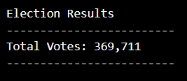
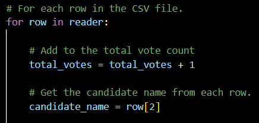
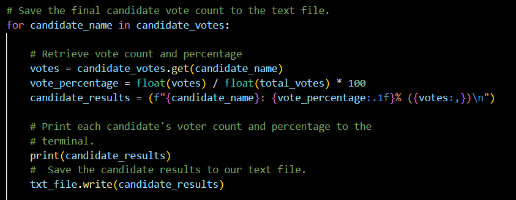
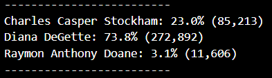
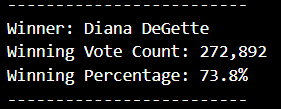
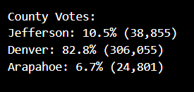
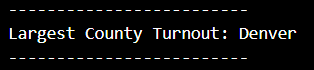
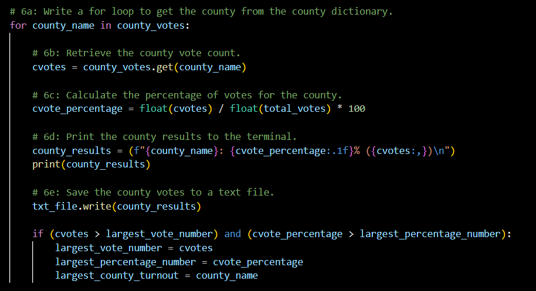

#### Challenge 3: Module 3

# Overview of Project

## Overview of Election Audit: 

The main purpose of the Challenge was to analyze the results of a recent local congressional election for the Colorado Board of Elections. The final result of the project is a complete election audit analysis with the final results. The audit could help to see if there is a relation between them, if something could be induced with all the results and to know what aspects for in the next elections could be changed. For example, the candidate for next elections could create a marketing strategy specifically in that county to have most of their votes because the results showed that county has the highest turnout. The economical part of campaigns could also be distributed differently using the audit results.

## Election-Audit Results: 

The code made during the Module was to help Tom and Seth to obtain the total number of votes cast, each candidate name, the total number of votes from each one and its percentage of votes. 
The first part of the script starts importing the csv file “election_results.csv”, where all the results with candidate name, county and Ballot ID are located. The part followed was the creation of variables, lists and dictionaries used for the next section. 
	
* Total number of votes cast.

In the congressional election there was a total of 369,711 votes, as can be seen in Image 1. The result was obtained reading the csv file and converting it into a list of dictionaries. In Image 2. the first “for” used inside the “with” of the open csv file can be seen. The variable “total_votes” is incremented with each row, having at the end the total votes for all the candidates.

###### Image 1. Total votes shown in the txt file.

###### Image 2. Code to obtain the total votes.

* Total number of votes and percentage for each candidate.

Image 3. shows the “if statement” used to see if “candidate_votes” needs to be incremented or changed to zero for other candidate. The “if” tells that if the candidate name is not in the candidate list called “candidate_options”, it means that the count of votes for the other candidate will end and a new vote count for another candidate will start. If that condition is True, the new candidate will be added to “candidate_options” and the count will start at zero. If the candidate name is already in the list, votes for that candidate will increase until the condition is True.

###### Image 3. Code to obtain the total votes for each candidate.

The total votes cast and the total votes for each candidate were used to obtain the percentage. The code to obtain the value and print the results appears in Image 4. It consists of a “for” loop, where each candidate's number of votes is divided by the total number of votes and the multiplied types one hundred. Each result was located in the “candidate_results” variable as a string. Then, that variable was printed and written in the txt file.

###### Image 4. Code to obtain the percentage of votes for each candidate.

The final result of that code appears in Image 5. All the candidates are shown with their percentage of votes from the total and the total number of votes.

###### Image 5. Candidates results shown in the txt file.

The winner was also shown from the results with the winning vote count and its percentage. 

* The winner.

The candidate that won the election was Diana DeGette with 272,892 votes, having 73.8% of all the votes. More than half of the votes were for her. The winner can be seen notoriously in Image 5., but a code was created to show just the winner with her results, as in Image 6. The code is explained in the “County with the largest number of votes” section and the code appears in Image 9. It is the same code but with different variables and uses other data for the comparison in the “if statement”.

###### Image 6. The winner shown in the txt file.

The next step made in the Challenge was to obtain the voter turnout for each county, the percentage of votes from each county out of the total count and the county with the highest turnout.

* Total number of votes and percentage for each county.

The code in this part is similar to the one used to obtain the total number of votes cast. The “if statement” is also located inside the same “for” loop and below that “if”. The only aspects changed were the variables and data specified using “county_name = row[1]”. In this case, the data going inside the “if” was all the county names and the results were the count of each name. The results are in Image 7. 
The percentage was also obtained like the percentages for the candidates. The code for this part can be seen in Image 9, above the code used to obtain the county with the largest number of votes.

###### Image 7. Total Votes for each County shown in the txt file.

* County with the largest number of votes.

It is also obvious that Denver is the county with the largest number of votes but the program needs a code to show the result. In this case, the code was an “if” with a comparison statement, where “county votes” was compared with the “largest vote number'' and “county percentage votes” with the “largest percentage number”. As it is shown in Image 9., if the statement was True variables “largest_vote_number”, “largest_percentage_number” and largest_county_turnout equals the information for that county. If the condition was False, there was nothing to do and the next value entered to the “if”, until the “for” ended.

###### Image 8. County with more votes shown in the txt file.

###### Image 9. Code to obtain the county percentage and the one with the largest number of votes.

## Election-Audit Summary: 

The script made for the local congressional election of Colorado could be used for other elections and could have a more complete analysis. Someone with a complete analysis of different elections can obtain different relations with variables and results. If that person or group wants to change or estimate the final results of the elections, these relations are going to be essential because every decision needs to be made based on data to reduce the probability of failure.
Some modifications could be adding a column with the budget designated for each candidate in each country and analyzing if there is a relation between the economical part and the results. Another change in the code is focused on obtaining the percentage of votes for each candidate in each county, knowing which candidate was the favorite for each specific county. A lot of changes could be made in the script, the actual code is the base to obtain more results for the analysis.

